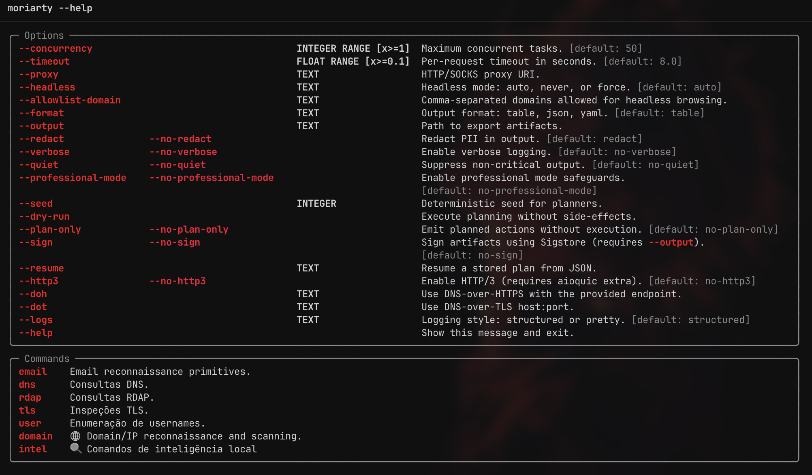

<div align="left">

<a href="https://pepy.tech/project/moriarty-project" style="text-decoration: none;"></a>
<a href="https://pypi.org/project/moriarty-project/" style="text-decoration: none;"></a>
<a href="https://github.com/DonatoReis/moriarty/stargazers" style="text-decoration: none;"></a>

# Moriarty

### Advanced OSINT and Digital Investigation Tool

*Advanced reconnaissance and security analysis tool for OSINT investigations and penetration testing*



</td>
<td width="50%">

**🌍 Language / Idioma:**  

<a href="README.md" style="text-decoration: none;"></a>
<a href="README.pt-br.md" style="text-decoration: none;"></a>
</div>

</td>
<td width="50%">

## 📑 Table of Contents

- [🌟 Key Features](#-key-features)
- [🚀 Installation](#-installation)
- [💻 Basic Usage](#-basic-usage)
- [🔍 Commands](#-commands)
- [🛡️ Security](#️-security-features)
- [🤝 Contributing](#-contributing)
- [📄 License](#-license)

</td>
<td width="50%">

## 🌟 Key Features

<table>
<tr>
<td width="50%">

### 🔍 Passive Reconnaissance
- OSINT information gathering
- Subdomain discovery
- SSL/TLS certificate analysis
- WHOIS/RDAP metadata

</td>
<td width="50%">

### 🛡️ Security Scanning
- Service and port detection
- Web technology identification
- Vulnerability scanner
- WAF/IPS/IDS detection

</td>
</tr>
<tr>
<td width="50%">

### 📧 Email Analysis
- DNS/SMTP validation
- Multi-source investigation
- Breach verification
- Reputation analysis

</td>
<td width="50%">

### 🎯 Threat Intelligence
- IOC analysis
- Credential verification
- Domain reputation
- Known threat detection

</td>
</tr>
</table>

</td>
<td width="50%">

## 🚀 Installation

### Prerequisites

```bash
Python 3.13+ | pip | pipx (recommended)
```

### Via pipx (Recommended)

```bash
# Install using pipx
pipx install moriarty-project

# Verify installation
moriarty --help
```

### Via pip

```bash
# Global installation
pip install moriarty-project

# User installation
pip install --user moriarty-project
```

### For Development

```bash
# Clone repository
git clone https://github.com/DonatoReis/moriarty.git
cd moriarty

# Create virtual environment
python -m venv venv
source venv/bin/activate  # Windows: venv\Scripts\activate

# Install in development mode
pip install -e .
pip install -r requirements-dev.txt
```

</td>
<td width="50%">

## 💻 Basic Usage

### Command Structure

```bash
moriarty [GLOBAL_OPTIONS] COMMAND [ARGUMENTS] [OPTIONS]
```

### Global Options

| Option | Description | Default |
|--------|-------------|---------|
| `--verbose` | Detailed logs | `False` |
| `--quiet` | Suppress output | `False` |
| `--concurrency INT` | Concurrent tasks | `50` |
| `--timeout FLOAT` | Timeout (seconds) | `8.0` |
| `--proxy URL` | HTTP/SOCKS proxy | - |
| `--format` | Output format | `table` |
| `--output PATH` | Save to file | - |

</td>
<td width="50%">

## 🔍 Commands

### 📧 Email

<details>
<summary><b>email check</b> - Validate email address</summary>

```bash
# Basic usage
moriarty email check user@example.com

# With options
moriarty email check --verbose user@example.com --format json --output result.json
```

</details>

<details>
<summary><b>email investigate</b> - Deep investigation</summary>

```bash
# Investigate across multiple sources
moriarty email investigate user@example.com --verbose
```

</details>

### 👤 User

<details>
<summary><b>user enum</b> - Enumerate username</summary>

```bash
# Check availability
moriarty user enum username

# On specific sites
moriarty user enum username --sites github,twitter,instagram --output results.json
```

</details>

### 🌐 Domain

<details>
<summary><b>domain scan</b> - Complete scan</summary>

```bash
# Full scan
moriarty domain scan example.com --stealth 2 --threads 50

# Specific modules
moriarty domain scan example.com --modules dns,ports,ssl
```

**Options:**
- `--modules`: all, dns, subdiscover, wayback, ports, ssl, crawl, fuzzer, template-scan, vuln-scan, waf-detect
- `--stealth`: Stealth level (0-4)
- `--threads`: Concurrent threads
- `--timeout`: Timeout in seconds

</details>

<details>
<summary><b>domain recon</b> - Passive reconnaissance</summary>

```bash
moriarty domain recon example.com --output results.json
```

</details>

### 🎯 Intelligence

<details>
<summary><b>intel ioc</b> - IOC analysis</summary>

```bash
moriarty intel ioc --file iocs.txt --output report.html
```

</details>

### 🌐 Network

| Command | Description |
|---------|-------------|
| `network dns` | Advanced DNS queries |
| `network tls` | TLS/SSL analysis |
| `network rdap` | RDAP queries |

### 🛠️ Tools

| Command | Description |
|---------|-------------|
| `tools template` | Template management |
| `tools waf` | WAF detection tests |

</td>
<td width="50%">

## 🛠️ Practical Examples

```bash
# 1. Basic scan with stealth
moriarty domain scan example.com --stealth 2 --threads 50

# 2. Complete passive reconnaissance
moriarty domain recon example.com --output results.json --format json

# 3. Email verification with investigation
moriarty email check user@example.com --verbose
moriarty email investigate user@example.com

# 4. IOC analysis with HTML report
moriarty intel ioc --file iocs.txt --output report.html

# 5. Username enumeration on social networks
moriarty user enum johndoe --sites github,twitter,linkedin
```

</td>
<td width="50%">

## 🛡️ Security Features

### Professional Mode

```bash
moriarty --professional-mode domain scan example.com
```

### Security and Privacy

- ✅ Encrypted connections (HTTPS/TLS)
- ✅ Automatic PII redaction
- ✅ Proxy and Tor support
- ✅ Digital signature of results
- ✅ Advanced stealth mode

</td>
<td width="50%">

## 🤝 Contributing

Contributions are welcome! 🎉

1. Fork the repository
2. Create a branch (`git checkout -b feature/NewFeature`)
3. Commit your changes (`git commit -m 'Add: New feature'`)
4. Push to the branch (`git push origin feature/NewFeature`)
5. Open a Pull Request

### Guidelines

- Follow the [Style Guide](CONTRIBUTING.md)
- Add tests for new features
- Update documentation
- Keep code clean and documented

</td>
<td width="50%">

## 📄 License

Distributed under the MIT License. See [`LICENSE`](LICENSE) for more information.

</td>
<td width="50%">

## 🌟 Acknowledgments

Thanks to all [contributors](https://github.com/DonatoReis/moriarty/graphs/contributors) who help make Moriarty better!

</td>
<td width="50%">

<div align="center">

**[⬆ Back to top](#moriarty)**

*Developed with ❤️ by the community*

</div>
